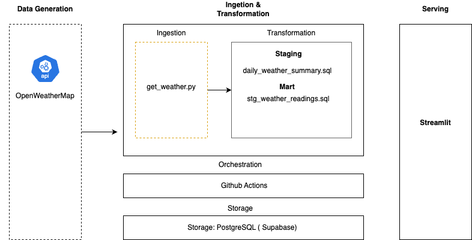

# OpenMapWeather-ETL
OpenMapWeather- ETL ( OpenWeatherMap ) is Data Engineering Project that extracts weather data from OpenWeatherMap API and transforms,aggregates data to show current and historical trends of weather in Baku.

## Architecture

## Features
- Automated hourly weather data extraction for Baku
- dbt transformations (raw → staging → gold layers)
- Live dashboard with current conditions and historical trends

## Tech Stack
- Python, dbt,GitHub Actions, Streamlit, PostgreSQL

## Live Demo
[[OpenWeatherBaku](https://openweatherbaku.streamlit.app/)]

## Project Structure
[Brief folder tree explanation]
